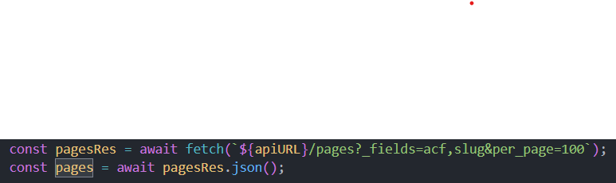

== Manual d'Administració VÍBRIA

=== Tecnologies

* *WordPress* - CMS per al backend
* *Astro* - Generació de frontend estàtic
* *PhpMyAdmin* - Gestió de base de dades MySQL

=== Accés

==== Accés a WordPress

* URL: http://localhost:8000/wp-admin
* Usuari: `wordpress`
* Contrasenya: `wordpress`

==== Accés a la Base de Dades (PhpMyAdmin)

* URL: http://localhost:8080
* Usuari: `wordpress`
* Contrasenya: `wordpress`

=== Connexió entre Backend i Frontend

* *Astro* consumeix contingut de *WordPress* mitjançant la seva REST API.
* El contingut es mostra en el frontend renderitzat de manera estàtica.

Exemple d'us:

=== Estructura del Frontend (Astro)
image::images/estructura.png[]

==== Comportament de les Rutes

|===
| Ruta | Funció

| `/` | Redirecció a la home
| `/ca/home-ca` | Home en català
| `/es/home-es` | Home en castellà
| `/ca/ofertes-ca` | Llistat d’ofertes
| `/ca/ofertes-ca/oferta-italia-ca` | Detall d’una oferta
|===

=== Comandes de Desenvolupament

[cols="2,6", options="header"]
|===
| Comanda | Funció

| `npm install` | Instal·la les dependències del projecte
| `npm run build` | Genera els arxius per a producció
| `npm run preview` | Previsualitza el build generat
|===

=== Plugins Instal·lats

[cols="2,6", options="header"]
|===
| Plugin | Funció

| Advanced Custom Fields (ACF) | Camps personalitzats per gestionar continguts complexos
| Code Snippets | Afegir fragments de codi PHP sense editar fitxers
| Custom Post Type UI (CPT) | Crear tipus de contingut personalitzats
| Polylang | Traducció i gestió multilingüe del contingut
| WP Mail SMTP | Configuració d’enviament de correus mitjançant SMTP
|===

== Respatller i Restauració de la Base de Dades
=== Actualitzar Docker amb els canvis del repositori Git

Si has fet canvis al repositori i necessites actualitzar la base de dades a Docker, hauries d'estar en la carpeta server i si estàs en Windows fer-lo en el Git bash, utilitza:

[source, bash]
----
cd server
docker exec -i server-db-1 mysql --default-character-set=utf8mb4 -u wordpress -pwordpress wordpress < ../data/backup.sql
----

=== Guardar els canvis per pujar-los a Git

Per fer una còpia de seguretat de la base de dades i pujar-la al repositori,hauries d'estar en la carpeta server i si estàs en Windows fer-lo en el Git bash.:

[source, bash]
----
cd server
docker exec server-db-1 mysqldump --default-character-set=utf8mb4 -u wordpress -pwordpress wordpress > ../data/backup.sql
----

=== Actualitzar Docker amb les imatges del repositori

Després de carregar la base de dades, pots recuperar les imatges que ha pujat el teu company amb:

[source, bash]
----
docker cp ../Blog/wordpress/wp-content/uploads/2025/05 server-wordpress-1:/var/www/html/wp-content/uploads/2025/
----

== Erros comuns i solucions
=== Si no pots guardar els canvis: accedir a la base de dades

Si obtens un error de permisos en fer el backup, accedeix primer a la base de dades:

[source, bash]
----
docker exec -it server-db-1 mysql -u root -p
----

==== Donar permisos al usuari de WordPress
Després, atorga els permisos necessaris a l'usuari de WordPress perquè pugui realitzar les accions necessàries:

[source, sql]
----
GRANT PROCESS, LOCK TABLES, SELECT, RELOAD, SHOW DATABASES, EVENT, TRIGGER, SHOW VIEW ON *.* TO 'wordpress'@'%';
FLUSH PRIVILEGES;
----

Torna a intentar guardar els canvis amb:

[source, bash]
----
docker exec server-db-1 mysqldump -u wordpress -pwordpress wordpress > ../data/backup.sql
----

=== Si WordPress demana permisos per instal·lar un plugin

Per solucionar problemes de permisos en instal·lar plugins:

[source, bash]
----
docker exec -it server-wordpress-1 chown -R www-data:www-data /var/www/html
----

=== Canvi de configuració de codificació a la base de dades

==== Accedir a la base de dades

[source, bash]
----
docker exec -it server-db-1 mysql -u root -p
----

==== Modificar la codificació i col·lació

[source, sql]
----
ALTER DATABASE wordpress CHARACTER SET utf8mb4 COLLATE utf8mb4_unicode_ci;
----

==== Verificar que el canvi s’ha aplicat correctament

[source, sql]
----
SELECT schema_name, default_character_set_name, default_collation_name
FROM information_schema.schemata
WHERE schema_name = 'wordpress';
----

Sortida esperada:

[cols="1,1,1", options="header"]
|===
|schema_name |default_character_set_name |default_collation_name
|wordpress   |utf8mb4                    |utf8mb4_unicode_ci
|===

Ara WordPress hauria de gestionar correctament els accents i caràcters especials.

=== Si WordPress mostra error crític després de pujar tot

Això pot ser perquè no s’han instal·lat bé els plugins. Prova el següent:

[source, powershell]
----
# 1. Eliminar vendor i lock file
cd Blog/wordpress
Remove-Item -Force composer.lock, vendor -Recurse

# 2. Reinstal·lar tot
composer install --optimize-autoloader
----
== Desplegament del Frontend

[source, bash]
----
cd vibria-brian-oscar-adrian/astro
npm install
npm run build
----

== Manual AWS

include::AWSVibria.adoc[]